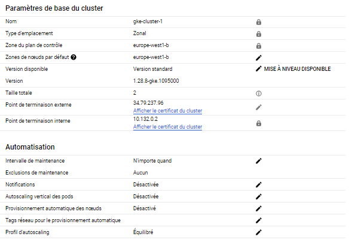
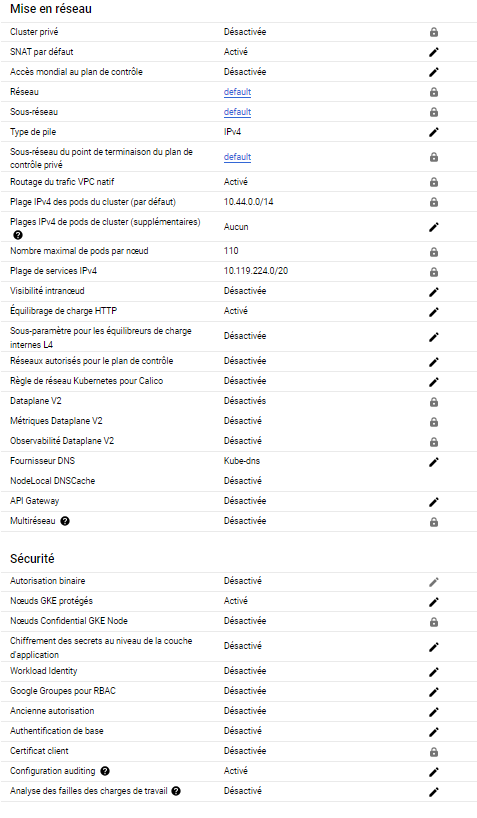

# Task 2 - Deploy the application in Kubernetes Engine

In this task you will deploy the application in the public cloud service Google Kubernetes Engine (GKE).

## Subtask 2.1 - Create Project

Log in to the Google Cloud console at <http://console.cloud.google.com/>, navigate to the __Resource Manager__ (<https://console.cloud.google.com/cloud-resource-manager>) and create a new project. 

## Subtask 2.2 - Create a cluster

Go to the Google Kubernetes Engine (GKE) console (<https://console.cloud.google.com/kubernetes/>). If necessary, enable the Kubernetes Engine API. Then create a cluster. 

* Choose a __GKE Standard__ cluster. (Please ensure that you are not using the Autopilot. The button to switch to Standard could be a bit tricky to find...)
* Give it a __name__ of the form _gke-cluster-1_
* Select a __region__ close to you.
* Set the __number of nodes__ to 2. 
* Set the __instance type__ to micro instances.
* Set the __boot disk size__ to 10 GB.
* Keep the other settings at their default values.

## Subtask 2.3 - Deploy the application on the cluster

Once the cluster is created, the GKE console will show a __Connect__ button next to the cluster in the cluster list. Click on it. A dialog will appear with a command-line command. Copy/paste the command and execute it on your local machine. This will download the configuration info of the cluster to your local machine (this is known as a _context_). It also changes the current context of your `kubectl` tool to the new cluster.

To see the available contexts, type :

```sh
$ kubectl config get-contexts
```

You should see two contexts, one for the Minikube cluster and one for the GKE cluster. The current context has a star `*` in front of it. The `kubectl` commands that you type from now on will go to the cluster of the current context.

With that you can use `kubectl` to manage your GKE cluster just as you did in task 1. Repeat the application deployment steps of task 1 on your GKE cluster.

Should you want to switch contexts, use :

```sh
$ kubectl config use-context <context>
```

## Subtask 2.4 - Deploy the ToDo-Frontend Service

On the Minikube cluster we did not have the possibility to expose a service on an external port, that is why we did not create a Service for the Frontend. Now, with the GKE cluster, we are able to do that.

Using the `redis-svc.yaml` file as an example, create the `frontend-svc.yaml` configuration file for the Frontend Service.

Unlike the Redis and API Services the Frontend needs to be accessible from outside the Kubernetes cluster as a regular web server on port 80.

  * We need to change a configuration parameter. Our cluster runs on the GKE cloud and we want to use a GKE load balancer to expose our service.
  * Read the section "Publishing Services - Service types" of the K8s documentation 
    <https://kubernetes.io/docs/concepts/services-networking/service/#publishing-services-service-types>
  * Deploy the Service using `kubectl`.

This will trigger the creation of a load balancer on GKE. This might take some minutes. You can monitor the creation of the load balancer using `kubectl describe`.

### Verify the ToDo application

Now you can verify if the ToDo application is working correctly.

  * Find out the public URL of the Frontend Service load balancer using `kubectl describe`.
  * Access the public URL of the Service with a browser. You should be able to access the complete application and create a new ToDo.


## Deliverables

Document any difficulties you faced and how you overcame them. Copy the object descriptions into the lab report (if they are unchanged from the previous task just say so).

> // Had to add the 'selector:' field, in order to expose the component "frontend".
```
❯ kubectl describe pod/frontend
Name:             frontend
Namespace:        default
Priority:         0
Service Account:  default
Node:             gke-gke-cluster-1-default-pool-568febae-jf7h/10.132.0.7
Start Time:       Sun, 19 May 2024 13:38:15 +0200
Labels:           app=todo
                  component=frontend
Annotations:      <none>
Status:           Running
IP:               10.76.1.5
IPs:
  IP:  10.76.1.5
Containers:
  frontend:
    Container ID:   containerd://8a687fc79388a3c3fa73659394c0d61e7571103e326bbf0178677ec5acc1d6ef
    Image:          icclabcna/ccp2-k8s-todo-frontend
    Image ID:       docker.io/icclabcna/ccp2-k8s-todo-frontend@sha256:5892b8f75a4dd3aa9d9cf527f8796a7638dba574ea8e6beef49360a3c67bbb44
    Port:           8080/TCP
    Host Port:      0/TCP
    State:          Running
      Started:      Sun, 19 May 2024 13:38:47 +0200
    Ready:          True
    Restart Count:  0
    Environment:
      API_ENDPOINT_URL:  http://api-svc:8081
    Mounts:
      /var/run/secrets/kubernetes.io/serviceaccount from kube-api-access-tsnzt (ro)
Conditions:
  Type              Status
  Initialized       True
  Ready             True
  ContainersReady   True
  PodScheduled      True
Volumes:
  kube-api-access-tsnzt:
    Type:                    Projected (a volume that contains injected data from multiple sources)
    TokenExpirationSeconds:  3607
    ConfigMapName:           kube-root-ca.crt
    ConfigMapOptional:       <nil>
    DownwardAPI:             true
QoS Class:                   BestEffort
Node-Selectors:              <none>
Tolerations:                 node.kubernetes.io/not-ready:NoExecute op=Exists for 300s
                             node.kubernetes.io/unreachable:NoExecute op=Exists for 300s
Events:
  Type    Reason     Age   From               Message
  ----    ------     ----  ----               -------
  Normal  Scheduled  10m   default-scheduler  Successfully assigned default/frontend to gke-gke-cluster-1-default-pool-568febae-jf7h
  Normal  Pulling    10m   kubelet            Pulling image "icclabcna/ccp2-k8s-todo-frontend"
  Normal  Pulled     10m   kubelet            Successfully pulled image "icclabcna/ccp2-k8s-todo-frontend" in 29.981s (29.983s including waiting)
  Normal  Created    10m   kubelet            Created container frontend
  Normal  Started    10m   kubelet            Started container frontend
```

```yaml
# frontend-svc.yaml
apiVersion: v1
kind: Service
metadata:
  labels:
    component: frontend
  name: frontend-svc
spec:
  type: LoadBalancer
  ports:
  - port: 80
    targetPort: 8080
    name: frontend
    protocol: TCP
  selector:
    component: frontend
```

Take a screenshot of the cluster details from the GKE console. Copy the output of the `kubectl describe` command to describe your load balancer once completely initialized.

> <br>
> <br>
> <br>

```
PS> kubectl describe service/frontend-svc
Name:                     frontend-svc
Namespace:                default
Labels:                   component=frontend
Annotations:              cloud.google.com/neg: {"ingress":true}
Selector:                 component=frontend
Type:                     LoadBalancer
IP Family Policy:         SingleStack
IP Families:              IPv4
IP:                       10.119.230.18
IPs:                      10.119.230.18
LoadBalancer Ingress:     34.38.1.105
Port:                     frontend  80/TCP
TargetPort:               8080/TCP
NodePort:                 frontend  32264/TCP
Endpoints:                10.44.2.10:8080
Session Affinity:         None
External Traffic Policy:  Cluster
Events:
  Type    Reason                Age    From                Message
  ----    ------                ----   ----                -------
  Normal  EnsuringLoadBalancer  7m51s  service-controller  Ensuring load balancer
  Normal  EnsuredLoadBalancer   7m9s   service-controller  Ensured load balancer
```