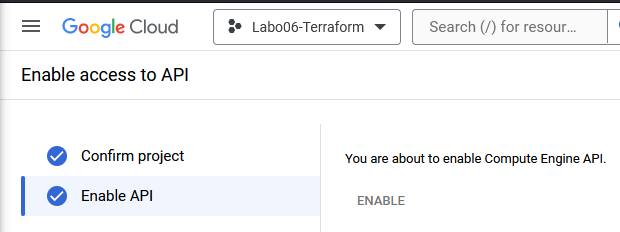
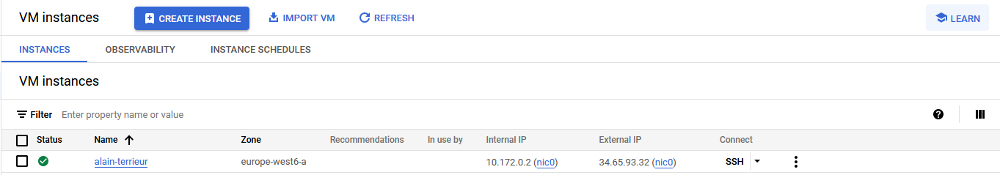

# Task 2: Create a cloud infrastructure on Google Compute Engine with Terraform

In this task you will create a simple cloud infrastructure that consists of a single VM on Google Compute Engine. It will be
managed by Terraform.

This task is highly inspired from the following guide: [Get started with Terraform](https://cloud.google.com/docs/terraform/get-started-with-terraform).

Create a new Google Cloud project. Save the project ID, it will be used later.

* Name: __labgce__

As we want to create a VM, you need to enable the Compute Engine API:

* [Navigate to google enable api page](https://console.cloud.google.com/flows/enableapi?apiid=compute.googleapis.com)



Terraform needs credentials to access the Google Cloud API. Generate and download the Service Account Key:

* Navigate to __IAM & Admin__ > __Service Accounts__. 
* Click on the default service account > __Keys__ and __ADD KEY__ > __Create new key__ (JSON format). 
* On your local machine, create a directory for this lab. In it, create a subdirectory named `credentials` and save the key under the name `labgce-service-account-key.json`, it will be used later.

Generate a public/private SSH key pair that will be used to access the VM and store it in the `credentials` directory:

    ssh-keygen \
      -t ed25519 \
      -f labgce-ssh-key \
      -q \
      -N "" \
      -C ""

At the root of your lab directory, create a `terraform` directory and get the [backend.tf](./appendices/backend.tf), [main.tf](./appendices/main.tf), [outputs.tf](./appendices/outputs.tf) and [variables.tf](./appendices/variables.tf) files. 

These files allow you to deploy a VM, except for a missing file, which you have to provide. Your task is to explore the provided files and using the [Terraform documentation](https://www.terraform.io/docs) understand what these files do. 

The missing file `terraform.tfvars` is supposed to contain values for variables used in the `main.tf` file. Your task is to find out what these values should be. You can freely choose the user account name and the instance name (only lowercase letters, digits and hyphen allowed).

You should have a file structure like this:

    .
    ├── credentials
    │   ├── labgce-service-account-key.json
    │   ├── labgce-ssh-key
    │   └── labgce-ssh-key.pub
    └── terraform
        ├── backend.tf
        ├── main.tf
        ├── outputs.tf
        ├── terraform.tfvars
        └── variables.tf

There are two differences between Google Cloud and AWS that you should know about:

1. Concerning the default Linux system user account created on a VM: In AWS, newly created VMs have a user account that is always named the same for a given OS. For example, Ubuntu VMs have always have a user account named `ubuntu`, CentOS VMs always have a user account named `ec2-user`, and so on. In Google Cloud, the administrator can freely choose the name of the user account.

2. Concerning the public/private key pair used to secure access to the VM: In AWS you create the key pair in AWS and then download the private key. In Google Cloud you create the key pair on your local machine and upload the public key to Google Cloud.

The two preceding parameters are configured in Terraform in the `metadata` section of the `google_compute_instance` resource description. For example, a user account named `fred` with a public key file located at `/path/to/file.pub` is configured as

    metadata = {
      ssh-keys = "fred:${file("/path/to/file.pub")}"
    }
    
This is already taken care of in the provided `main.tf` file.

You can now initialize the Terraform state:

    cd terraform
    terraform init

[OUTPUT]
```bash
❯ terraform init

Initializing the backend...

Successfully configured the backend "local"! Terraform will automatically
use this backend unless the backend configuration changes.

Initializing provider plugins...
- Finding latest version of hashicorp/google...
- Installing hashicorp/google v5.30.0...
- Installed hashicorp/google v5.30.0 (signed by HashiCorp)

Terraform has created a lock file .terraform.lock.hcl to record the provider
selections it made above. Include this file in your version control repository
so that Terraform can guarantee to make the same selections by default when
you run "terraform init" in the future.

Terraform has been successfully initialized!

You may now begin working with Terraform. Try running "terraform plan" to see
any changes that are required for your infrastructure. All Terraform commands
should now work.

If you ever set or change modules or backend configuration for Terraform,
rerun this command to reinitialize your working directory. If you forget, other
commands will detect it and remind you to do so if necessary.
```
    
* What files were created in the `terraform` directory? Make sure to look also at hidden files and directories (`ls -a`).

[OUTPUT]
```bash
 ❯ l
Permissions Size User    Date Modified Name
drwxrwxrwx     - nicolas 23 May 16:17  .terraform
.rwxrwxrwx  1.2k nicolas 23 May 16:17  .terraform.lock.hcl
.rwxrwxrwx    38 nicolas 23 May 16:10  backend.tf
.rwxrwxrwx  1.0k nicolas 23 May 16:10  main.tf
.rwxrwxrwx   114 nicolas 23 May 16:10  outputs.tf
.rwxrwxrwx   255 nicolas 23 May 16:14  terraform.tfvars
.rwxrwxrwx   510 nicolas 23 May 16:10  variables.tf
```

> We end up with the follow file structure

    .
    ├── credentials
    │   ├── labgce-service-account-key.json
    │   ├── labgce-ssh-key
    │   └── labgce-ssh-key.pub
    └── terraform
        ├── .terraform
        │   ├── terraform.tfstate
        │   └── providers
        │       └── registry.terraform.io
        │           └── hashicorp
        │               └── google
        │                   └── 5.30.0
        │                       └── linux_amd64
        │                           ├── LICENSE.txt
        │                           └── terraform-provider-google_v5.30.0_x5
        ├── .terraform.lock.hcl
        ├── backend.tf
        ├── main.tf
        ├── outputs.tf
        ├── terraform.tfvars
        └── variables.tf


* What are they used for?

|File/FolderName|Explanation|
|:--|:--|
| .terraform.lock.hcl | Keeps track of the version of the gcloud plugin used |
| .terraform/terraform.tfstate | Stores the state of the infrastructure |
| .terraform/providers/registry.terraform.io/hashicorp/google/5.30.0/linux_amd64/terraform-provider-google_v5.30.0_x5 | Binary file of the provider's plugin |
| .terraform/providers/registry.terraform.io/hashicorp/google/5.30.0/linux_amd64/LICENSE.txt | License's file |


* Check that your Terraform configuration is valid:

```bash
terraform validate
```

[OUTPUT]
```bash
❯ terraform validate
Success! The configuration is valid.
```

* Create an execution plan to preview the changes that will be made to your infrastructure and save it locally:

```bash
terraform plan -input=false -out=.terraform/plan.cache
```

```
// copy the command result in a file named "planCache.json" and add it to your lab repo.
```

* If satisfied with your execution plan, apply it:

```bash
    terraform apply -input=false .terraform/plan.cache
```

```
// copy the command result in a file name "planCacheApplied.txt
```

> Dû à une erreur dans le user (non validé selon la règle regex), il a fallu refaire les commandes juste pour appliquer la partie erronée.

* Test access via ssh

[INPUT]
```bash
❯ ssh alt@34.65.93.32 -i ~/.ssh/labgce-ssh-key
```

> The key file location had to be changed as using ssh in WSL with an key saved in the Windows partition always causes issues as the permissions are dealt with differently.

[OUTPUT]
```
Welcome to Ubuntu 20.04.6 LTS (GNU/Linux 5.15.0-1060-gcp x86_64)

 * Documentation:  https://help.ubuntu.com
 * Management:     https://landscape.canonical.com
 * Support:        https://ubuntu.com/pro

 System information as of Thu May 23 14:59:01 UTC 2024

  System load:  0.0               Processes:             93
  Usage of /:   19.1% of 9.51GB   Users logged in:       0
  Memory usage: 34%               IPv4 address for ens4: 10.172.0.2
  Swap usage:   0%

Expanded Security Maintenance for Applications is not enabled.

0 updates can be applied immediately.

Enable ESM Apps to receive additional future security updates.
See https://ubuntu.com/esm or run: sudo pro status


The programs included with the Ubuntu system are free software;
the exact distribution terms for each program are described in the
individual files in /usr/share/doc/*/copyright.

Ubuntu comes with ABSOLUTELY NO WARRANTY, to the extent permitted by
applicable law.

alt@alain-terrieur:~$
```

If no errors occur, you have successfully managed to create a VM on Google Cloud using Terraform. You should see the IP of the Google Compute instance in the console. Save the instance IP, it will be used later.

After launching make sure you can SSH into the VM using your private
key and the Linux system user account name defined in the `terraform.tfvars` file.

Deliverables:

* Explain the usage of each provided file and its contents by directly adding comments in the file as needed (we must ensure that you understood what you have done). In the file `variables.tf` fill the missing documentation parts and link to the online documentation. Copy the modified files to the report.

```
backend.tf
main.tf
outputs.tf
terraform.tfvars
variables.tf
```

* Explain what the files created by Terraform are used for.
```
The files created by Terraform in the `terraform` directory serve different purposes:

1. `.terraform.lock.hcl`: This file stores dependencies, meaning the providers needed and the versions used.

2. `.terraform`: This directory contains the configuration file describing the resources Terraform has to manage.

These files are essential for managing the infrastructure using Terraform.
```

* Where is the Terraform state saved? Imagine you are working in a team and the other team members want to use Terraform, too, to manage the cloud infrastructure. Do you see any problems with this? Explain.
```
In the file "terraform.tfstate". Yes, because the state is stored locally. We would need to store it in the cloud, or an area available for every authorized person. To do this, we should not write "local" in the backend.tf file.
```

* What happens if you reapply the configuration (1) without changing `main.tf` (2) with a change in `main.tf`? Do you see any changes in Terraform's output? Why? (3) Can you think of examples where Terraform needs to delete parts of the infrastructure to be able to reconfigure it?

```
1. Terraform will compare the current state with the configuration in main.tf. If there are no changes, Terraform will indicate that no changes are necessary.
2. Terraform will detect the differences between the current state and the new configuration. It will then plan and apply the necessary changes to reach the desired state defined in main.tf.
3. Yes, when we change the instance type of a VM. Terraform will need to delete it to recreate
one with the right state, since it will do whatever it can to reach the desired state.
```

* Explain what you would need to do to manage multiple instances.

```
count or for_each argument. It will allow us to create multiple instances with the same configuration.
```

* Take a screenshot of the Google Cloud Console showing your Google Compute instance and put it in the report.



* Deliver a folder "terraform" with your configuration.